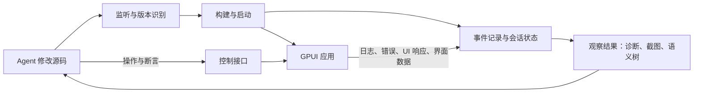

# 设计：面向 Agent 的 Live 错误反馈与界面观察

状态：D1 已实现；D2–D4 待实现。`gpui dev status / diagnostics / events` 已可用，`observe / act / check` 仍为拟议接口。D1 的交付范围与验证见第 9 节。
日期：2026-09-20
设计事实基线：本仓库 `c5b0c7f`；模板锁定的 `gpui-pre 0.3.5` 源码。第 2 节保留实施前基线。
前置设计：[Live 模式](DESIGN-live-mode.md)。沿用 L0 重建重启、L1 资源重载、L0.5 状态恢复。

后续详细计划（2026-09-21，基线 `6d091b6`）：[Agent-native 总路线](ROADMAP-agent-native-development.md)、[实施任务清单](roadmap/implementation-backlog.md)、[验收矩阵](roadmap/acceptance-matrix.md)。本文保留 D1 的历史背景与实现记录；D2–D4 的版本契约、命令和执行顺序以新专项设计为准。例如正式场景入口拟为根命令 `gpui check`，下文早期 `gpui dev check` 示意不构成兼容承诺。

## 1. 目标与关键决定

让 agent 每次修改代码后，都能回答三个问题：**这次修改是否成功运行、运行中的界面变成了什么、交互是否符合预期。**

推荐在现有 live 上增加统一的观察与控制接口：



live 负责确定性的构建、运行、采集和执行；agent 负责判断与修复代码。CLI 不内置模型调用。人类终端输出、JSON 命令和后续 MCP 适配器消费同一套状态。

第一优先级是可信的反馈闭环。继续采用已验证的重启与状态恢复路线，不把函数级热补丁作为本设计的依赖。

## 2. 已有基础与实际缺口

| 位置 | 当前能力 | 本次需要补齐 |
| --- | --- | --- |
| `src/commands/live.rs` | 保存触发重建、构建合并、失败保留旧 app、重启恢复状态 | 会话状态查询；把正在编辑、正在构建和正在运行的版本分开；构建期间也能处理观察请求 |
| `src/commands/error.rs` | desktop/iOS 的 Cargo JSON 解析 | 诊断边读边发布；保留错误码、完整 spans、notes、suggestions、warnings；当前只收集 error 并在构建结束后打印 |
| `live.rs::run_quiet` | 收集 cargo-ndk、Gradle、Xcode 输出，失败打印最后 40 行 | 同时持续读取 stdout/stderr，保存原始输出；Android Rust 诊断接入 Cargo JSON |
| `src/devserver/mod.rs` | TCP 通道接收日志、panic 和状态快照 | 可查询、可重放的事件；请求关联；连接消息不再直接决定终端输出 |
| `templates/app/src/live.rs` | `log` 转发、panic hook、资源更新 | 启动早期日志、已有 logger 的组合、UI 线程响应、窗口注册、观察和操作命令 |
| 平台适配 | desktop 退出检测；模拟器/Android 的 dev 通道 | 原生日志兜底、移动进程状态、窗口/设备截图；iOS 真机当前仍没有 dev 通道 |

两个实现细节需要在扩展前处理：

- `DevServer::wait_for` 读取同一个消息队列并丢弃不匹配消息；持续日志也会进入没有持续消费的无界队列。新增观察请求必须使用持续消费的事件分发器和按 `request_id` 路由的响应，不能继续复用这个等待模型。
- app 侧 `log::set_boxed_logger` 失败后不会接管既有 logger。Android 已安装原生 logger 时，不能认为其普通日志已经通过 dev 通道到达 CLI；需要组合日志出口或采集 logcat。

## 3. 先保证错误反馈可靠

### 3.1 统一事件，再派生展示与查询

各个采集器只发布类型化事件，由一个会话内排序器分配递增 `seq`，更新当前状态并写入事件记录。所有终端和机器输出从这里派生。

事件公共字段：`schema_version`、`session_id`、`seq`、`received_at`、`kind`，以及适用时的 `target_id`、`build_id`、`run_id`、`request_id`、`window_id`。时间用于展示，跨设备排序采用 supervisor 分配的 `seq`；不依赖设备时钟一致。

| 事件类别 | 示例 | 必须带上的上下文 |
| --- | --- | --- |
| 源码与构建 | `source.changed`、`build.started`、`diagnostic`、`build.finished`、`build.superseded` | 输入版本、构建阶段、退出码、诊断和完整日志引用 |
| 运行状态 | `app.started`、`app.connected`、`app.exited`、`app.disconnected` | 启动代次、PID、预期重启或意外退出；信号在平台可获取时记录 |
| 运行错误 | `app.log`、`app.error`、`app.panic` | 级别、模块、源码位置、错误链/堆栈、相关操作 |
| UI 与资源 | `ui.responsive`、`ui.unresponsive`、`ui.frame`、`ui.changed`、`asset.applied` | 窗口、内容版本、帧、应用资源结果 |
| 观察与测试 | `observation.ready`、`action.finished`、`check.finished` | 请求、前后观察、断言结果、产物引用 |

编译诊断保留 rustc 原始 JSON，并提供规范化字段。工具没有结构化诊断时，仍记录阶段、命令、退出码和完整日志；不伪造源码位置。无法解析的输出也不能直接丢弃。

### 3.2 捕获范围与故障判定

- **编译、链接、打包、安装、启动**：独立阶段，读到错误就发布，不等整个命令结束。stdout/stderr 并行排空，JSON 模式不混入原始子进程输出、颜色码和进度文案。
- **业务错误**：支持显式 `report_error` 或日志适配器，保留错误链、处理状态和操作上下文。Rust 返回的每个 `Err` 不会自动变成可观测事件；预期的表单校验错误也不应自动判为应用故障。
- **panic 与原生崩溃**：panic hook 是尽力上报；进程可能在发送前结束。desktop 保存子进程 stdout/stderr 与退出状态，Android 使用限定应用/进程的 logcat 并在重启后更新过滤条件；其他平台通过独立适配器补充系统日志和崩溃报告。原生日志无法确定所属 run 时标记未知，不能归到最新 run。
- **UI 卡死**：后台连接存活与 UI 线程能响应是两个维度。定期向 UI 线程投递轻量探测，超时发出 `ui.unresponsive`；不能因为静态界面没有新帧就判断卡死。应用后台、系统休眠和设备暂停应有对应状态。
- **断线**：只证明观察通道断开，不能直接断言 app 已崩溃。已收到 panic、退出状态、UI 超时等证据分别保存。

已安装的 `log` / `tracing` / 平台日志设施通过适配器组合，不静默争抢全局 logger。连接建立前采用有界缓冲，日志洪峰允许丢弃低优先级消息但必须报告丢弃量。panic 等关键事件使用预留容量和平台日志兜底，仍不承诺进程死亡时零丢失。

### 3.3 错误的生命周期

编译诊断按构建批次组织，新一轮完整结果替换“当前诊断”，历史仍可查询。同一运行错误可以按来源、位置和错误码聚合，保留出现次数与首次/末次事件。

**构建恢复只代表构建错误解除。** runtime panic 或交互错误在新进程启动后应是“待复验”；只有重新执行相关场景并通过断言，才能将修复记为已验证。观察期间没有日志不等于功能正确。

## 4. 所有观察都必须知道自己属于哪一版

至少区分以下身份：

| 身份 | 用途 |
| --- | --- |
| `session_id` | 一次 `run --live` 的生命周期；与现有重启状态快照的 session 概念区分 |
| `source_revision` / `asset_revision` | 当前期望的源码与资源版本；资源更新可以不产生新 build |
| `build_id` | 一次构建及其产物、输入清单、诊断 |
| `run_id` | 一次应用启动；重启即变化，不能只靠可复用的 PID |
| `window_id` / `frame_id` | 某次运行中的窗口与完成的帧；帧编号不跨 run 比较 |
| `observation_id` | 诊断、界面数据及其一致性说明组成的一次观察 |

会话状态同时保留 `desired` 和 `running`。例如当前源码为 42，但 build 42 失败、窗口仍显示源码 41，应明确返回：

```json
{
  "desired": { "source_revision": 42, "asset_revision": 7 },
  "build": { "id": "b42", "status": "failed" },
  "running": { "run_id": "r18", "source_revision": 41, "asset_revision": 7 },
  "ui": { "status": "responsive", "stale": true },
  "diagnostics": [{ "code": "E0308", "message": "mismatched types" }]
}
```

需要满足这些约束：

1. 启动时注入 `build_id`、`run_id` 和握手随机值；服务端将连接绑定到该次启动。旧连接迟到的日志和回复不能改变新进程状态。资源和观察命令发给明确 run/window，不能广播后接受任意客户端的回复。
2. 构建记录输入清单。构建期间输入变化则将结果标记为 superseded，不将它用于本轮验证，继续合并重建。watcher 计数本身不是精确源码证明；常规 live 用输入清单前后检查和变更记录，要求严格可复现的检查使用冻结的输入快照。
3. agent 完成一批编辑后，`observe --sync` 主动扫描输入并锁定期望版本，避免 watcher 的去抖尚未结束就错误返回“已完成”。等待期间再次发生编辑，应返回目标被 superseded，不能悄悄改为等待另一个版本。
4. 资源消息写入 socket 只代表发送。需要 app 确认缓存失效、资源加载结果和相关帧；有失败或尚未加载的必需资源时不能宣布更新已验证。旧代码搭配新资源也必须如实返回两个版本。
5. 状态拆为 build、process、channel、UI、check 等维度。Cargo 成功、进程已启动、通道已连接、首帧完成、场景通过，分别是不同事实。

## 5. 界面感知：截图、语义与交互相互补充

### 5.1 一次观察返回一个有依据的结果包

`observe` 返回：目标版本与运行身份、当前诊断和增量错误、截图引用、语义树引用、与前一次观察的差异、窗口尺寸/DPI/主题、可用能力和缺失原因。

截图回答颜色、间距、裁剪和视觉层次是否正确；语义树回答控件是什么、在哪里、有什么状态、来源于哪个视图。后续按需补充样式检查；不能假设无障碍树包含所有布局元素和计算样式。

结果必须声明一致性等级：

- **同一帧**：从同一已完成 frame 的语义数据和渲染 scene 产生像素；两者绑定相同内容版本。
- **尽力对齐**：平台截图在帧屏障后采集，并记录采集前后帧/版本；采集过程中变化则报告不一致或重试。
- **部分结果**：树不可用、截图失败、窗口不可见或超时，分别返回原因。不能把旧截图重新标记为最新观察。

`settle` 采用有截止时间的条件等待：目标版本已应用、UI 响应、必需资源就绪、所选窗口的相关变化在一段窗口内停止。建议初始静稳窗口 300 ms，可配置；持续动画返回 `settled: false` 及原因。业务异步完成仍依赖显式 ready 条件或断言。

### 5.2 优先复用已存在的 GPUI 能力

本次源码核对发现以下基础，但没有对真实窗口执行 PoC，不能据此宣布跨平台能力已经可用：

| GPUI 0.3.5 接口/模块 | 可复用部分 | 边界 |
| --- | --- | --- |
| `Window::debug_a11y_tree_json()`；`window/a11y/debug.rs` | 帧元数据、角色、文本/值、部分状态；debug 下的 view、element_id、source_location | 依赖无障碍树实际激活；返回 `None` 或历史帧时要明确区分；当前 JSON 未导出 author/accessibility ID、节点边界等全部属性 |
| `.id()`、`.role()`、`.accessibility_id()`、`.aria_label()` | 为模板和组件补全语义及稳定选择器 | `.id()` 不等同于外部可见的 accessibility_id；无 role 的自绘 div 可能不会进入语义树 |
| `inspector.rs` | 源码位置和元素检查基础 | 当前检查器不等于可远程导出的完整元素/样式树 |
| `Window::render_to_image()` | 当前 scene 的像素读回；macOS/Windows 有相应实现 | 受 `test-support` 门控，需要验证 feature 传递、成本和平台支持；不包含所有原生嵌入视图/系统弹窗 |
| `Window::dispatch_event()` | 通过 GPUI 正常输入分发路径注入事件 | 需要在 UI 线程执行；平台输入法、系统对话框还需系统层测试 |

语义树激活必须纳入最初的 PoC：通过受支持的平台无障碍客户端激活，或给 GPUI 增加仅开发模式生效的观察接口；不要求用户一直开着屏幕阅读器。当前 JSON 中的 `a/b/c` 是每次导出的临时别名，不能作为跨帧测试选择器。当前 JSON 也未包含节点的 author/accessibility ID、bounds、disabled 等关键属性。模板现在提供显式 `declare_logical_id(element_id, logical_id)` bridge，并只把声明后的映射写入 adapter 输出；未声明时仍保持 unsupported，CLI 不能凭截图或 `.id()` 猜测后填充为已知事实。完整 author ID/bounds 导出仍需上游 GPUI API 或后续 adapter。

推荐默认模板为关键控件设置稳定 `accessibility_id`、role 和名称。例如计数按钮使用 `counter.increment`；测试按这个 ID 查找，不依赖文案语言、坐标或源码行号。无障碍与自动化复用同一套业务语义。

首帧确认也要单独验证。`on_next_frame` 的回调名称不能当成 GPU 呈现完成的证据；当前实现会在一次平台帧的 draw/present 前执行待处理回调。需要读取确认完成的帧，或增加 frame-complete 接口，并区分 scene 完成与屏幕已显示。

### 5.3 截图的平台策略

优先验证 macOS 应用内 scene 读回，作为桌面闭环的第一条路径；只在 live 开发构建启用相关功能。平台适配器作为补充：

- iOS simulator：`simctl io <udid> screenshot`。
- Android：`adb -s <serial> exec-out screencap -p`。
- desktop：按目标窗口捕获；无权限或后端不支持时返回明确 capability/error。

设备截图可能包含系统栏、键盘和其他应用，必须记录捕获范围并核对前台应用；应用 scene 读回与设备屏幕截图也要分别标识。iOS 真机 dev 通道、截图及操作能力单独验证，保留现有 L0 能力，不假设与模拟器等价。

图片写入会话产物目录。事件只传 artifact ID、尺寸、哈希和采集元数据，图片按需读取。移动端不能直接写宿主机文件；走平台截图工具或独立的有界分块传输，不能把大 PNG 塞进当前 1 MiB JSON 帧。

### 5.4 感知变化，而不持续传输整屏

应用重绘/失效通知只是变化线索。合并短时间通知，在成功更新、操作结束、错误出现或显式请求时采集观察。

语义差异报告节点增删、文字/值、边界、焦点与可用状态；视觉差异报告变化区域和图片引用。纯颜色变化可能不改变语义树，仍需像素比较。去除时间戳、临时节点别名等噪声后再计算语义摘要。

默认推送小型变化摘要，截图按需获取；需要自动设计预览时可订阅经过限流的缩略图。视觉差异用于定位变化，是否属于回归由场景断言、批准的基线或设计判断决定。

## 6. Agent 接口与修复流程

建议以 CLI JSON 接口先交付；后续 MCP 是同一 API 的薄适配层。

| 拟议命令 | 目的 |
| --- | --- |
| `gpui dev status --json` | 会话、期望/运行版本、各阶段状态、能力列表、当前事件游标 |
| `gpui dev events --after <seq> --timeout 30s --json` | 有界长轮询，获取新事件；另外提供显式 `--follow` NDJSON 流 |
| `gpui dev diagnostics --json` | 查询当前构建诊断和未复验的运行问题，原始日志按引用读取 |
| `gpui dev observe --sync --settle 300ms --timeout 30s --json` | 同步编辑并锁定目标，返回本轮错误或完成的观察；不强制没有变化的项目重编译 |
| `gpui dev act click --id counter.increment --observation <id> --json` | 基于指定观察执行操作，返回 operation ID 和执行结果 |
| `gpui dev check --scenario counter --json` | 从指定场景状态执行交互与断言，返回可复现的结果包 |

这些命令连接当前项目的 live supervisor。多会话时要求明确 `--session`，多窗口时明确 `--window`；不猜测最近的一个。普通 JSON 命令的失败也返回结构化结果并使用非零退出码。

一次典型修复流程：

1. agent 修改一批文件，调用 `observe --sync`。
2. 编译失败即返回错误位置、相关源码版本、错误码和建议；旧窗口的截图只能作为明确标为 stale 的参考。
3. 修改通过后，等待对应 run/window 完成观察，检查截图、语义差异和运行问题。
4. 执行相关交互，再观察或运行场景断言。`action.finished` 只表示输入处理完成，不代表业务目标达成。
5. 验证失败时，带着失败断言、前后截图、语义差异及事件区间继续修复。

`events` 和等待中的 `observe` 可以在错误到达时立即返回，agent 不必反复抓取整个终端。事件源提供实时性；是否立即唤起一次 agent 推理取决于宿主是否支持订阅/通知。仅增加 MCP server 不会自动让一个空闲 agent 开始修复。

操作按窗口串行执行，并检查观察对应的 run、内容版本和目标节点是否仍有效；失效返回 `stale_observation`。优先使用稳定 ID 重新定位并验证可见性/可操作性，坐标操作必须绑定截图尺寸和坐标变换。输入事件走真实分发与命中测试路径，避免直接调用业务 handler 绕过遮挡和 disabled 状态。

请求带 `request_id` 并记录结果，防止连接重试重复点击。同一 run 内可返回已保存的执行结果；跨崩溃无法确认执行情况时返回 unknown，不自动重放有副作用的操作。

## 7. 运行结构、兼容与成本

仍由 `gpui run --live` 持有会话，不引入永久后台服务。构建 worker、平台日志采集和 app 通道持续发布事件，独立的控制入口始终能响应 status/observe；同步 Cargo 构建不能阻塞查询和 UI 健康检查。

```text
.gpui/live/<session_id>/
  session.json          # 项目/目标/进程身份、控制端点、能力
  events-*.ndjson        # 有界保留、可按 seq 重放的事件分段
  state.json            # 原子替换的当前状态与对应 seq
  logs/                 # 分阶段原始输出
  artifacts/            # 截图、语义树、diff、场景结果
```

注册信息以项目规范路径和目标标识区分，会话退出后标记结束；新客户端验证端点身份，不能把遗留文件当成存活服务。现有 `.gpui/sessions/` 重启状态快照继续独立保存。

先提供有界内存保留和分段日志，不引入数据库。队列、磁盘、图片数量、单次响应均有上限；慢订阅者收到 gap/dropped 信息，再通过 state 查询恢复。游标过期返回最早可用 seq 和 resync 要求，不能默默跳过错误。重放与转入实时订阅之间也不能漏事件。

复用 loopback 与会话认证；控制客户端和 app 使用明确的角色和消息类型。新请求携带版本与 capabilities，旧模板仍能使用原有 live 功能，新命令返回 unavailable/upgrade_required。协议结构复杂后采用类型化 JSON 编解码，逐步替换模板里的字符串扫描，不让协议在 CLI 和模板里各自演化。

建议的落点：

| 文件/模块 | 调整 |
| --- | --- |
| `src/commands/error.rs` | 流式诊断与原始事件保留 |
| `src/commands/live.rs` | 构建 worker、版本编排、生命周期、平台采集管理 |
| `src/devserver/protocol.rs` | 请求关联、run 身份、能力、UI/资源确认消息 |
| `src/devserver/events.rs`、`session.rs`、`control.rs`（新增） | 事件记录、状态派生、查询订阅与命令路由 |
| `src/commands/dev.rs`（新增）、`src/main.rs` | agent CLI 入口与 JSON 输出 |
| `templates/app/src/live.rs`、`lib.rs` | UI 线程执行、窗口登记、日志适配、观察接口 |
| `src/device/android.rs`、`ios.rs` | 原生日志、进程与截图适配 |

## 8. 实施顺序与验收

| 阶段 | 交付 | 通过标准 |
| --- | --- | --- |
| D1：错误闭环 | 统一事件、版本身份、status/diagnostics/events、流式构建输出 | agent 中途接入仍能读到本轮错误；失败保留旧 app 并标明版本；构建期间可查询；日志洪峰不导致无界增长 |
| D2：界面闭环 | macOS 截图/帧同步 PoC、UI 响应检测、`observe --sync`；随后补模拟器适配 | 能自动取得本轮改动的界面；截图与树的一致性如实报告；崩溃、断线、静止界面、UI 卡死分别识别 |
| D3：操作与断言 | 无障碍激活/导出 PoC、稳定 ID、语义 diff、操作与基本 check | 点击计数按钮后能断言数值变化；禁用或遮挡时不能假成功；旧 run 的选择器/回复不能误作用于新 run |
| D4：回归与适配 | 场景文件、视觉基线、更多平台，按接入需求增加 MCP | 失败可重现；平台差异与缺失能力明确；CLI 和 MCP 得到相同的事件与结果 |

交互调试默认继续恢复应用状态；可重复的场景检查使用独立测试数据和明确 reset，不继承上一次随意点击留下的状态。固定窗口尺寸、DPI、主题、语言、字体、数据、随机种子；需要时控制时间和网络。视觉基线按平台/渲染后端区分，允许声明动态区域与容差；更新基线是独立操作，不作为修复失败测试的自动步骤。

核心验收场景：

- 制造编译错误 → agent 收到结构化诊断 → 旧窗口仍可用且 stale → 修复后观察确实来自新 run。
- 在构建中连续保存、在截图中途重启、在重建时只改资源 → 不把错误、截图或 ACK 归给错误版本。
- 启动早期 panic、主动 abort、正常关窗、断开 dev 通道、阻塞 UI 线程 → 分别提供可用证据；不能把通道存活当 UI 正常。
- 改按钮颜色但不改语义 → 视觉 diff 检出；改点击逻辑但不改外观 → 场景断言检出。
- 无屏幕阅读器、未授权的平台截图、旧模板、设备离线 → 返回具体能力/错误，不无限等待或伪装为成功。
- 订阅断开后重连、游标过期、低优先级日志溢出 → 可恢复状态并明确指出信息缺口。

记录而非预先承诺端到端速度：分开度量“保存到首条诊断”“错误采集到订阅可见”“构建完成到观察可用”“操作到断言完成”。优化这些耗时之前，先确保每次反馈关联正确且能够复验。

## 9. D1 实现记录（2026-09-20）

已实现的入口：

```bash
gpui run --live
# 在同一应用项目的另一个终端中：
gpui dev status --json
gpui dev diagnostics --json
gpui dev events --after <seq> --timeout 30s --json
gpui dev events --follow --json
gpui dev status --session <session_id> --json
```

查询回复统一使用 `{schema_version, session_id, ok, result|error}` 外层结构。`status.result.seq` 可以作为后续事件请求的游标；事件分页使用 `next_seq` 与 `has_more`。`--follow --json` 逐行返回事件，每个事件含会话、目标、构建/启动身份及源码/资源版本。时间戳为 `received_at_ms`，即 Unix 毫秒。

实际实现与边界：

- `events.rs` 负责顺序编号、当前状态、事件保留和磁盘轮转；`control.rs` 的独立 loopback 入口在 Cargo 构建期间也能处理查询与长轮询。控制请求使用独立于 app 的凭据和角色。
- `session.rs` / `inputs.rs` 为项目文件记录 SHA-256 内容清单，分别更新源码和资源版本；构建前后重新检查。中途变化的产物被标为 superseded 后重建。输入范围是项目目录，忽略构建输出；目录符号链接会在清单中声明未跟踪，外部 path dependency 不属于当前范围。这不是冻结源码构建。
- `app_channel.rs` 为每次启动轮换 token，由连接绑定 `run_id`；兼容原有 v1 模板。日志直接进入有界事件存储，快照响应按启动身份与请求 session 路由，不再经过消费并丢弃其他消息的等待队列。
- desktop/iOS 的 Cargo 和 Android 的 cargo-ndk 都接入流式 JSON 诊断；Xcode/Gradle 输出并行读取 stdout/stderr。平台安装与启动记录独立阶段结果，仍复用现有设备适配器。`build.status` 当前表示整个构建/启动轮次的结果，`build.stage` 和 `build.error` 定位具体失败阶段。
- `build.last_output` 保存标准输出和错误输出的末段与原始日志引用；没有 rustc JSON 的工具失败也能通过诊断查询定位输出。编译器没有提供源码位置时，规范化位置字段返回 null。
- desktop 在握手前就捕获 stdout/stderr，并独立监控退出，包括构建期间的意外退出。移动端启动命令成功先记为 `launched`，通道连接后才记为进程 `running`；未把启动命令成功当作 UI 正常。普通错误日志使用 `app.log` 的 error 级别，panic 使用 `app.panic`；原生日志采集与显式 `report_error` / tracing 适配未加入本次交付。
- 当前版本是否过期由 `stale` 表示；UI 状态由窗口 heartbeat 提供，资源 ACK 只确认收到并完成缓存失效，不确认 GPU 呈现。`assets_confirmed` 只在 ACK 对应当前 `asset_revision` 且无失败路径时为 true。运行错误在重启后保留为待复验，不因为构建成功而清除。
- 内存事件最多 2,048 条 / 4 MiB，单次事件页最多 128 条 / 512 KiB；过期游标返回 `cursor_expired`。磁盘事件最多 8 个 1 MiB 分段，原始输出最多 8 个 4 MiB 分段。当前诊断和运行问题同样有上限，超出时返回 omitted 计数。历史会话目录暂不自动删除。
- 原始输出按带上下文的 NDJSON 分块保留，引用含路径、字节偏移和长度；引用的旧分段可能被轮转淘汰。超过 64 KiB 的单行输出保留为多个原始块，超长 Cargo JSON 行可能无法生成结构化诊断。超限事件明确标记截断，不能无限增大查询响应。
- `q`、Ctrl-C 和终止信号会停止当前构建及 desktop 子进程，结束会话并唤醒事件订阅。已结束会话通过保存的文件检查，CLI 不把遗留注册文件当成仍存活的服务。

验证包括真实 Cargo 构建的端到端测试 `tests/live_feedback.rs`：初次启动、故意制造 E0308、旧进程保留、修复恢复、构建中再次编辑、过期产物淘汰、握手前 panic、增量订阅与正常结束。同时覆盖完整诊断信息、事件游标过期、日志轮转、控制认证、多会话选择、旧进程消息隔离和快照响应路由。真实 UI、移动设备和界面截图未在 D1 中验证。
