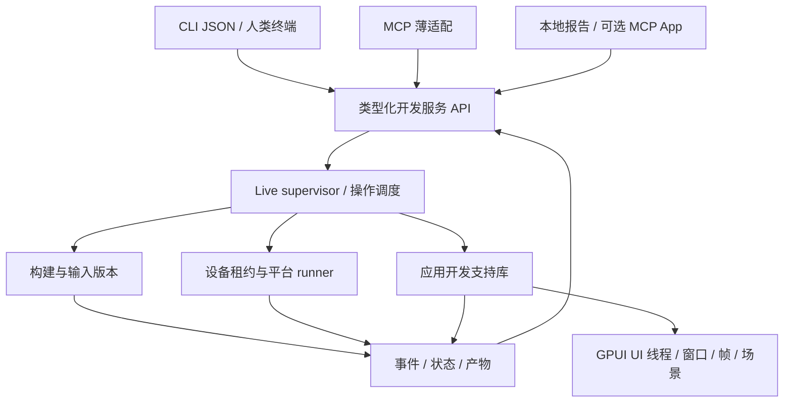
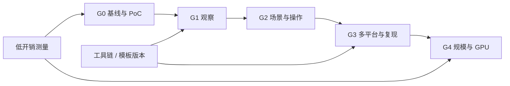

# 路线图：面向人和 Agent 的跨平台 GPUI 开发与验证

状态：设计草案，待按任务逐项实现。本文落地的是设计与实施计划，不代表新命令已经可用。

日期：2026-09-21。代码基线：`6d091b6`（PR #18 合并后）。目标应用是 GPUI 原生 UI 应用，包含其 GPU 渲染性能；不扩展为通用 GPU 计算框架。

## 1. 如何使用这组文档

| 文档 | 负责回答的问题 |
| --- | --- |
| 本文 | 为什么做、先做什么、何时算完成 |
| [实施任务清单](roadmap/implementation-backlog.md) | 每个 PR 的输入、代码落点、依赖、交付物和验收 |
| [验收与实验矩阵](roadmap/acceptance-matrix.md) | 如何复现失败、怎样判定通过、需要哪些机器 |
| [观察协议](design/observation-protocol.md) | 版本身份、截图/树一致性、资源确认、操作生命周期 |
| [组件场景与交互检查](design/scenarios-and-checks.md) | 如何独立预览组件、执行输入、编写可重复断言 |
| [平台矩阵与复现包](design/platform-matrix-and-repro.md) | 跨端执行、设备独占、远程 runner、失败重放 |
| [性能与 GPU](design/performance-and-gpu.md) | 测量什么、怎样比较、如何接入外部 GPU 工具 |
| [Agent 接口](design/agent-interfaces.md) | CLI/MCP/Skills/文档知识/交互预览如何共用能力 |
| [工具链与升级](design/toolchain-and-upgrades.md) | doctor、模板升级、开发支持库、输入索引和构建缓存 |
| [研究与决策记录](roadmap/research-and-decisions.md) | 外部资料的事实、取舍、未验证假设和重审条件 |
| [配置与响应示例](examples/README.md) | 可解析的提案示例及其字段说明 |

阅读顺序：本文 → 观察协议 → 实施任务清单 → 本次任务涉及的专项设计 → 对应验收用例。

规范用语：“必须”是验收条件；“建议”允许在 PR 中说明替代方案；“实验”必须先提交证据再决定产品化。“拟议”命令不能写成当前用户教程。所有新任务初始状态均为 `planned`。

发生冲突时，协议字段和失败语义以专项设计为准，任务依赖与验收编号以实施清单和验收矩阵为准；修改它们必须在同一 PR 更新所有引用。

## 2. 当前事实与缺口

### 2.1 已有能力

- 创建和添加桌面、iOS、Android 宿主项目；GPUI 依赖版本集中锁定于 [template.rs](../src/template.rs)。
- Live 的增量构建、失败保留旧应用、资源发送和应用显式状态恢复。
- [session.rs](../src/devserver/session.rs)、[events.rs](../src/devserver/events.rs) 记录会话、源码/资源修订、build/run 和有界事件。
- `gpui dev status / diagnostics / events`，控制连接独立于应用连接，构建期间可以查询。
- 流式 Cargo 诊断，桌面 stdout/stderr、退出状态和子进程树清理。
- PR #18 修复模板转义、设备选择、Android APK 产物识别及 ABI 配置；增加模板检查。

### 2.2 尚未具备的能力

| 缺口 | 当前代码事实 | 后果 |
| --- | --- | --- |
| UI 是否响应/呈现 | `ui_observation` 为 false；没有窗口/帧确认 | 进程启动不能证明 UI 正常 |
| 资源是否应用 | 有发送事件，`assets_confirmed` 为 false | 不能证明最新图片已被加载并用于当前场景 |
| 界面结构与输入 | 无对外的节点查询、输入和断言 API | Agent 仍依赖手工截图、点击和判断 |
| 完整移动日志 | 原生日志采集未实现 | 早期 native crash、Android logger 输出缺少兜底 |
| 场景和跨端验证 | 无场景注册、矩阵 runner、复现包 | 无法用同一测试说明各端行为是否一致 |
| 既有项目升级 | `init --add` 是加平台和冲突保护，不是升级器 | 更新 CLI 不会自动修复旧模板 |
| 环境确定性 | doctor 尚无按目标的结构化判定 | Agent 难以区分代码错误与环境缺失 |
| 输入与构建效率 | [inputs.rs](../src/devserver/inputs.rs) 反复遍历并哈希项目；外部 path dependency 未跟踪 | 大项目扫描成本和版本覆盖边界需要显式处理 |

当前 CI 的 Android 模板任务使用小型 ELF 测试库验证宿主打包，不代表完整 GPUI Android 应用或真机运行通过。macOS 模板任务是 debug/release `cargo check`，不是图形端到端验证。

### 2.3 与既有设计的关系

[Live 设计](DESIGN-live-mode.md) 保留 L0/L1/L0.5 的实现与失败实验记录。[Agent 反馈设计](DESIGN-agent-live-feedback.md) 保留 D1 的设计背景和实现记录。本组文档细化 D2–D4，并补齐工程基础、性能与接入路线。旧文档的实施前现状不用于覆盖本节基线。

## 3. 产品目标与边界

主要目标：缩短“编辑开始到获得可信验证结果”的时间，同时减少错误归因、重复操作和无用上下文。

优先支持三种工作：

1. 修改组件后立即看到正确版本的界面，能定位裁剪、布局和运行错误。
2. 修复交互后重跑受控场景，留下可复验的断言和证据。
3. 一次修改在多个平台执行同一场景，报告平台差异及性能退化。

本路线不承诺：任意 Rust 代码无编译热更新；任意应用堆内存录制重放；不同 GPU/字体的截图完全一致；通过截图推断真实 GPU 耗时；Linux 渲染结果替代 Metal 真机验证；仅增加 MCP 就自动唤醒空闲 Agent。

不在近期范围内：自研模型、聊天 IDE、云账号/付费系统、应用商店自动发布、新 UI DSL、通用浏览器自动化引擎。现有原生应用模型保持为共享 Rust UI 加平台宿主。

## 4. 总体结构

### 4.1 职责分配

- CLI：参数解析、选择会话、输出/退出码；不另写一套验证逻辑。
- Supervisor：唯一操作状态机、身份校验、版本跟踪、事件排序、deadline 和资源上限。
- 应用支持库：UI 线程响应、窗口注册、GPUI 适配、场景初始化；不直接操作宿主文件系统。
- Runner：平台命令、安装/启动/截图/日志/进程证据；每个平台声明真实支持的能力。
- 产物层：内容哈希、持久化引用、配额、完整性、导出；大对象不塞进事件帧。
- Agent 适配：把工具调用映射到相同 API；不决定测试是否通过，不绕过设备和操作约束。

### 4.2 拟议代码落点

| 区域 | 现有落点 | 拟议新增/抽取 |
| --- | --- | --- |
| 协议与共享类型 | `src/devserver/protocol.rs`、`events.rs` | `crates/gpui-dev-protocol`；v1 编解码兼容层 |
| 应用开发支持 | `templates/app/src/live.rs` | `crates/gpui-dev-runtime`；模板保留薄初始化代码 |
| 观察 | `src/devserver/session.rs`、`control.rs` | `operations.rs`、`observe.rs`、`artifacts.rs` |
| 场景与断言 | 暂无 | `src/scenario/`、`src/commands/preview.rs`、`check.rs` |
| 平台执行 | `src/device/`、`src/commands/live.rs` | `src/runner/`、`src/runner/lease.rs` |
| 环境与升级 | `doctor.rs`、`config.rs`、`template.rs` | `src/toolchain/`、`src/upgrade/` |
| 性能与 Agent | 暂无 | `src/perf/`、`src/agent/` |

上述新路径都不是当前已有模块。任务开始时以清单指定的最小落点为准；不提前创建空目录或空 API。

## 5. 里程碑、依赖与发布门槛

| 门槛 | 交付 | 必须有的证据 | 不能以什么替代 |
| --- | --- | --- | --- |
| G0：可行性与基线 | 工具链报告、延迟基线、GPUI 观察 PoC | 固定版本下真实窗口的帧/截图/树实验记录 | 文档中存在方法名 |
| G1：可信观察，D2a | macOS 窗口、心跳、资源确认、`observe --sync`、产物读取 | 错误版本不能被标为最新；构建中仍可查询；旧模板正确降级 | 进程启动成功、socket 写入成功 |
| G2：场景闭环，D2b/D3 | 组件预览、节点查询、输入、断言、MCP 基础接入 | 从 reset 开始的计数器/表单/列表场景能重复运行 | Agent 自述“看起来正确” |
| G3：跨端复验，D4a | Android/iOS 模拟器适配、矩阵、租约、复现包 | 相同源码/场景在各目标有独立结果；失败能重放 | 桌面通过、仅打包通过 |
| G4：性能与规模，D4b | 性能预算、索引/缓存、Agent 基准；按需晋升 GPU/远程能力 | 固定环境的测量分布；可选 provider 各自的捕获/调度证据 | 单帧 FPS 或不同设备的裸数值比较 |

工程基础和低开销测量从 G0 开始；远程执行、交互预览和热参数实验不是 G1 的依赖。某个平台未通过门槛时，只能发布已验证的平台能力。

## 6. 最先实施的五个工作包

1. **F01：基线与夹具**。固定 counter/form/list 三类夹具；记录当前编辑到诊断、构建、启动的阶段耗时；沿用现有测试建立比较基线。
2. **T01/T02：工具链与模板基线**。T01 按目标检查工具退出状态、SDK/JDK/NDK/架构；F01 后以 T02 记录可取得的模板基线，为复现环境和升级做准备。
3. **P01：GPUI 观察 PoC**。在 F01/T01 后验证 macOS 真实窗口、UI 线程探测、图像读回、完成帧和无障碍激活；列明所需最小上游接口。
4. **F02：版本协议与薄 runtime**。P01/T02 后引入独立版本维度、兼容投影、请求关联和最小应用适配，保持 D1；T03/T04 提供升级与恢复路径。
5. **O01–O04：macOS 观察闭环**。逐步加入窗口/心跳、资源 ACK、产物存储和同步观察，按对应故障用例验收。

第一轮开发不加入多平台调度或 GPU 自动诊断。G1 达成后再发布“Agent 能观察新界面”的能力声明。

## 7. 工时与任务拆分规则

清单中的 S/M/L 分别代表熟悉项目的工程师约 0.5–1、1–3、3–5 个有效工作日；XL 必须先拆分。估计不含等待设备、上游合并、签名权限和外部服务排队，不是工期承诺。

每个 PR 必须能在功能关闭或能力缺失时合并，不留下伪成功路径。跨模块改动按照“共享类型 → 服务端 → runtime → CLI/适配 → 真实平台验收”安排，不能同时改变所有边界而没有兼容测试。

## 8. 衡量效率的方法

| 指标 | 起点 → 终点 | 统计要求 |
| --- | --- | --- |
| `edit_to_diagnostic_ms` | 明确编辑提交点 → 首条相关诊断可查询 | 分首次构建/热缓存；失败样本保留 |
| `edit_to_observation_ms` | 编辑提交点 → 对应观察终态 | 分成功、失败、superseded、超时 |
| `build_to_observation_ms` | 编译产物完成 → 有效观察 | 与安装/启动耗时分开 |
| `action_to_assertion_ms` | 输入操作提交 → 场景断言终态 | 超时不能从分布中静默删除 |
| `verification_success_rate` | 固定任务集中正确验证数 / 总任务数 | 必须使用外部已知答案，不由 Agent 自评 |
| `wrong_revision_acceptance` | 错把旧版本认作本轮的次数 | 必须为 0 |
| `tool_calls`、`response_bytes` | 每个固定开发任务的调用数和响应字节 | token 为按指定 tokenizer 得到的估计，注明版本 |

G0 先采集至少 10 次预热和 30 次测量的基线。G1 的本地小夹具工程预算暂定：普通状态查询 P95 ≤ 200 ms、已有运行的 UI 探测 P95 ≤ 500 ms、无新构建的观察 P95 ≤ 2 s。这是固定测试环境的设计目标，不是跨平台产品性能承诺。证据不支持时记录瓶颈并修订预算，不放宽版本正确性。

## 9. 发布与完成定义

- 所有“支持”都能映射到验收编号、运行环境和产物；实验不能出现在默认能力列表中。
- 模板升级方案必须与新 runtime 协议同批次交付；保留老模板使用 D1 的路径。
- 日志、截图、输入、profile 构建分别声明能力；release 默认不携带开发控制入口。
- README、命令 help、JSON 示例和迁移说明与本次发布相符。
- 本地单元测试、协议契约测试、对应平台集成测试分别报告。没有设备不能用 `skip` 冒充平台通过。
- CI 的普通任务保持轻量；真实窗口/设备测试进入单独任务，失败上传可解释的证据。

## 10. 实施者开工清单

1. 从实施清单选择一个任务 ID，确认所有前置任务的验收产物存在。
2. 核对当前 commit 与本文基线的差异；若已有实现，先更新事实表。
3. 写出该任务要新增/修改的文件和要通过的验收编号。
4. 先准备一个会失败的真实触发场景，再实现最小功能。
5. 检查旧模板/旧客户端、取消、重启、权限缺失、配额五类边界。
6. 在 PR 中附环境、命令、结果、已知限制；只把已完成任务改为 `done`。
7. 若 PoC 失败，提交实验记录和替代方案，后续依赖保持 `blocked_by_experiment`，不删去验收要求。

完整任务状态、PR 模板和依赖见 [implementation-backlog.md](roadmap/implementation-backlog.md)。
